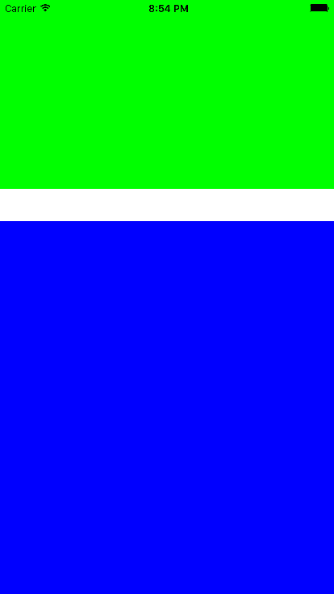

# SwiftLayoutConstraints

[](https://travis-ci.org/ahmadbaraka/SwiftLayoutConstraints)

`SwiftLayoutConstraints` aims to provide expressive `NSLayoutConstraint` with Swift.

#### Compatibility

SwiftLayoutConstraints targets `Swift 2.2`

## Basic Constraints

Basic Constraints can be made such as:

```swift
// assume we have 2 views and they are added to one parent
let view1 = UIView()
view1.translatesAutoresizingMaskIntoConstraints = false
view1.backgroundColor = UIColor.greenColor()
let view2 = UIView()
view2.translatesAutoresizingMaskIntoConstraints = false
view2.backgroundColor = UIColor.blueColor()
view.addSubview(view1)
view.addSubview(view2)

// Expressions below create, **activate** and return constraints
view1.ls_top | .Left | .Right ~== view
view2.ls_top ~== view1.ls_bottom + 40
view1.ls_height ~== view.ls_height * 0.25 + 50
view2.ls_left | .Right | .Bottom ~== view
```
The above code generates this output:  


## Overview

LayoutConstraints are represented as `LayoutConstraintType`, and has two implementations:
 1. [LhsLayoutConstraint](/SwiftLayoutConstraints/Classes/LhsLayoutConstraint.swift) represents left-hand side, and does NOT support mutating its `constant` and `multiplier.`
 1. [RhsLayoutConstraint](/SwiftLayoutConstraints/Classes/RhsLayoutConstraint.swift) represents right-hand side, and supports mutating its `constant` and `multiplier.`

## Relation Operators

`SwiftLayoutConstraints` introduces operators to represent each `NSLayoutRelation`, simply `~` is added before the expressive form of the relation.
 * `~==` for `NSLayoutRelation.Equal`
 * `~>=` for `NSLayoutRelation.GreaterThanOrEqual`
 * `~<=` for `NSLayoutRelation.LessThanOrEqual`

## Installation

This project is currently under development. But a [CocoaPod](https://cocoapods.org) will be available. And [Carthage](https://github.com/Carthage/Carthage) will be supported as well.

## License

SwiftLayoutConstraints is available under the MIT license. See the LICENSE file for more info.
